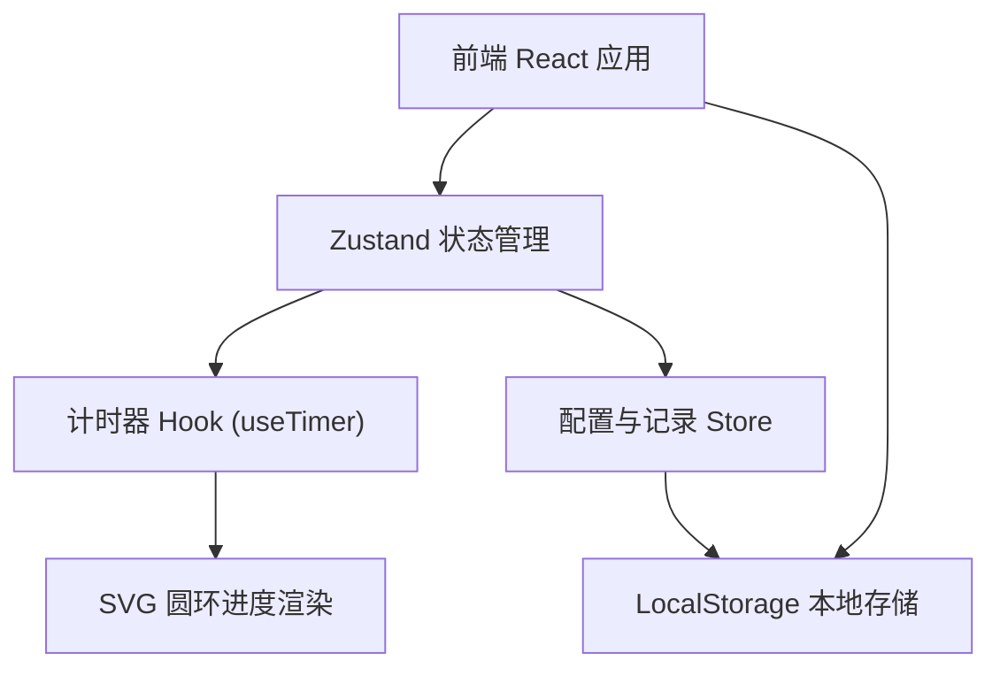

## 1. 架构设计



## 2. 技术说明

- 前端：React@18 + TypeScript + TailwindCSS@3 + Vite
- 初始化工具：vite-init
- 状态管理：Zustand
- 数据存储：浏览器 LocalStorage
- 后端：无（纯前端应用）

## 3. 路由定义

| 路由 | 用途 |
|------|------|
| / | 番茄钟主页面 |

## 4. 数据模型

### 4.1 本地存储数据结构

```typescript
interface PomodoroConfig {
  focusDuration: number;  // 专注时长（分钟），默认 25
  breakDuration: number;  // 休息时长（分钟），默认 5
}

interface DailyRecord {
  date: string;           // YYYY-MM-DD
  completedPomodoros: number;
}

interface AppState {
  config: PomodoroConfig;
  records: DailyRecord[];
}
```

### 4.2 运行时状态

```typescript
type TimerMode = 'focus' | 'break';
type TimerStatus = 'idle' | 'running' | 'paused';

interface TimerState {
  mode: TimerMode;
  status: TimerStatus;
  remainingSeconds: number;
  todayCompleted: number;
}
```

## 5. 模块说明

| 模块 | 文件路径 | 职责 |
|------|----------|------|
| 主应用组件 | src/App.tsx | 页面整体布局与渲染 |
| 番茄钟组件 | src/components/PomodoroWidget.tsx | 计时卡片主体 UI |
| 圆形进度条 | src/components/CircleProgress.tsx | SVG 倒计时圆环 |
| 设置面板 | src/components/SettingsModal.tsx | 时长配置弹窗 |
| 计时器 Hook | src/hooks/useTimer.ts | 倒计时核心逻辑 |
| 状态管理 Store | src/store/pomodoroStore.ts | 配置与记录状态管理 |
| 本地存储工具 | src/utils/storage.ts | LocalStorage 读写封装 |
