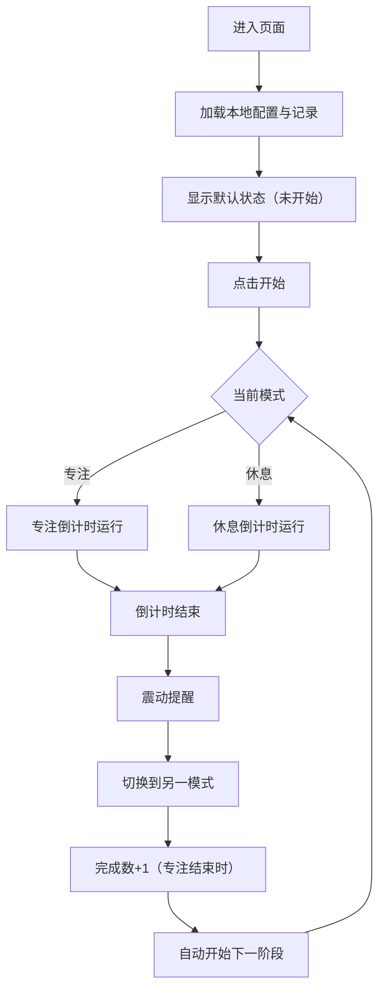

## 1. 产品概述

桌面番茄钟小组件，帮助用户进行专注计时与休息切换。
- 以手机小组件尺寸的卡片形式呈现，提供极简的专注计时体验
- 支持专注/休息自动切换、时长配置、震动提醒、今日统计等核心功能

## 2. 核心功能

### 2.1 用户角色
| 角色 | 注册方式 | 核心权限 |
|------|----------|----------|
| 普通用户 | 无需注册 | 使用所有计时功能，本地存储配置与记录 |

### 2.2 功能模块
1. **主页面**：倒计时圆环、状态标签、控制按钮、今日统计
2. **设置面板**：专注时长、休息时长配置

### 2.3 页面详情
| 页面名称 | 模块名称 | 功能描述 |
|----------|----------|----------|
| 主页面 | 倒计时圆环 | SVG 圆形进度条，实时显示剩余时间比例 |
| 主页面 | 时间显示 | 圆环中央显示 MM:SS 格式倒计时 |
| 主页面 | 状态标签 | 圆环下方显示"专注中"或"休息中" |
| 主页面 | 控制按钮 | 开始/暂停/重置按钮 |
| 主页面 | 今日统计 | 底部显示今日完成番茄数 |
| 设置面板 | 时长配置 | 分别设置专注和休息时长（分钟） |

## 3. 核心流程

用户打开页面 → 显示默认时长 → 点击开始 → 专注倒计时进行 → 完成后震动提醒 → 自动切换休息模式 → 休息倒计时 → 完成后震动提醒 → 自动切换专注模式 → 循环进行，累计今日完成数。

## 4. 用户界面设计

### 4.1 设计风格
- **主色调**：番茄红（专注）#E74C3C、薄荷绿（休息）#3EB489
- **背景色**：对应模式的渐变背景
- **按钮样式**：圆角胶囊按钮，悬浮有微动画
- **字体**：现代无衬线字体，数字使用等宽风格
- **布局风格**：居中卡片式布局，手机小组件尺寸（约 340px × 420px）
- **图标风格**：极简线性图标

### 4.2 页面设计概述
| 页面名称 | 模块名称 | UI 元素 |
|----------|----------|----------|
| 主页面 | 倒计时卡片 | 渐变背景、圆角卡片、阴影、状态切换过渡动画 |
| 主页面 | 圆形进度条 | SVG stroke-dasharray 动画、平滑过渡 |
| 主页面 | 时间数字 | 大字号、加粗、居中、等宽数字 |
| 主页面 | 控制按钮 | 行内排列、图标+文字、点击反馈 |
| 设置面板 | 配置弹窗 | 数字输入框、保存/取消按钮 |

### 4.3 响应性
- 桌面端：居中显示固定尺寸卡片
- 移动端：自适应宽度，最小边距保留
- 触摸优化：按钮足够大（≥ 44px）

